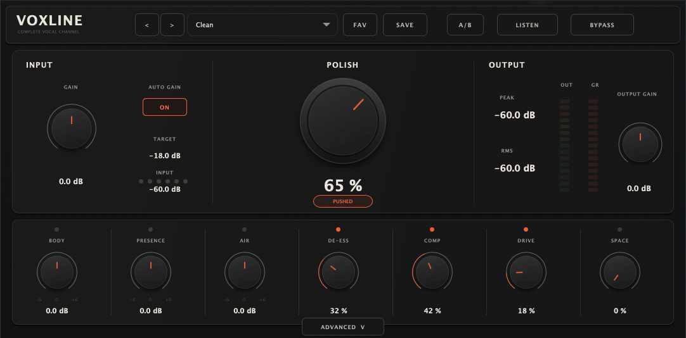
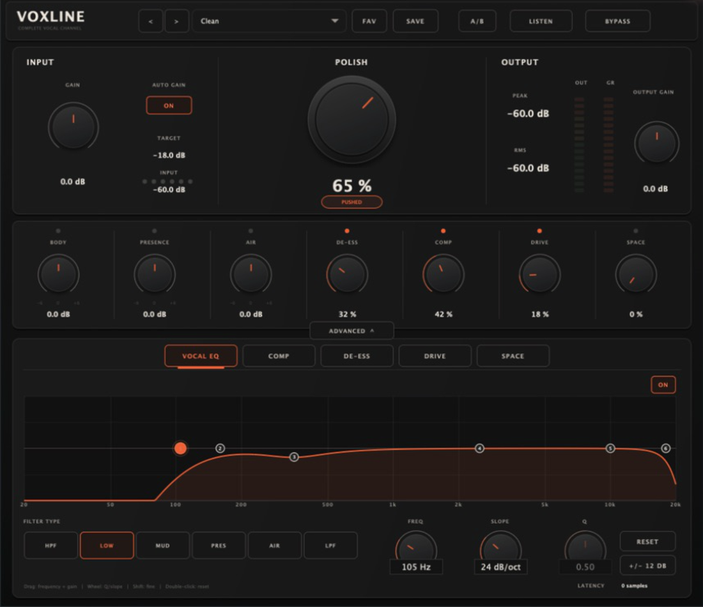
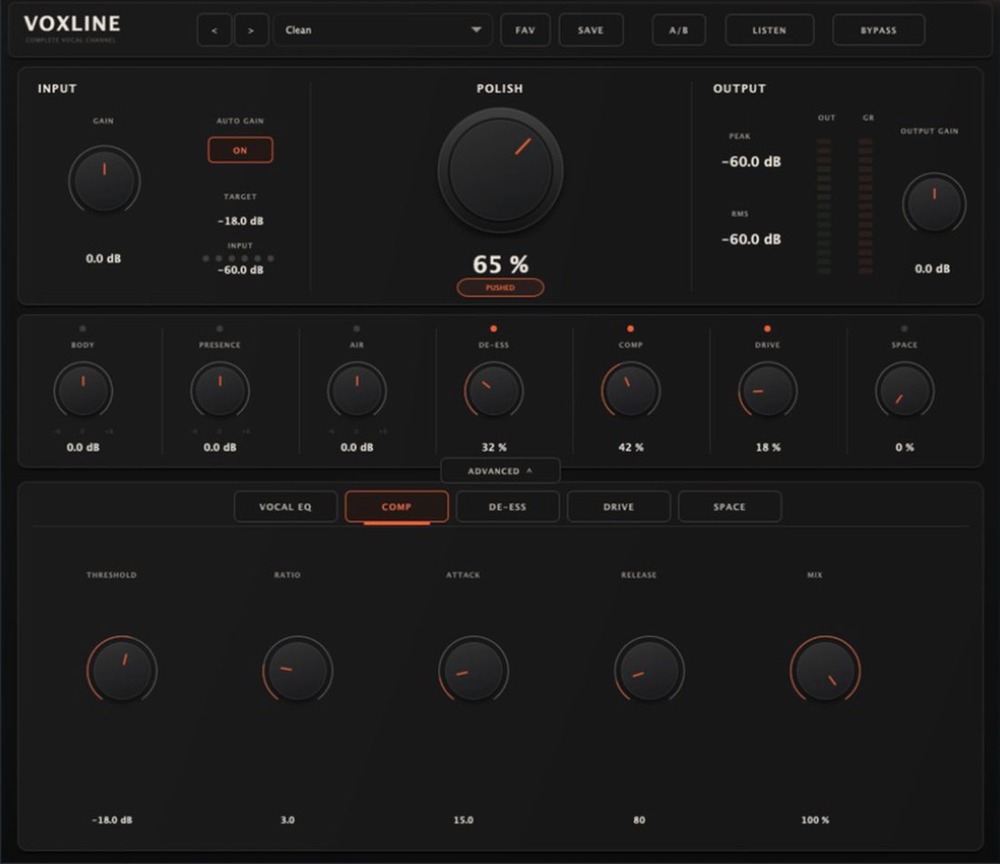
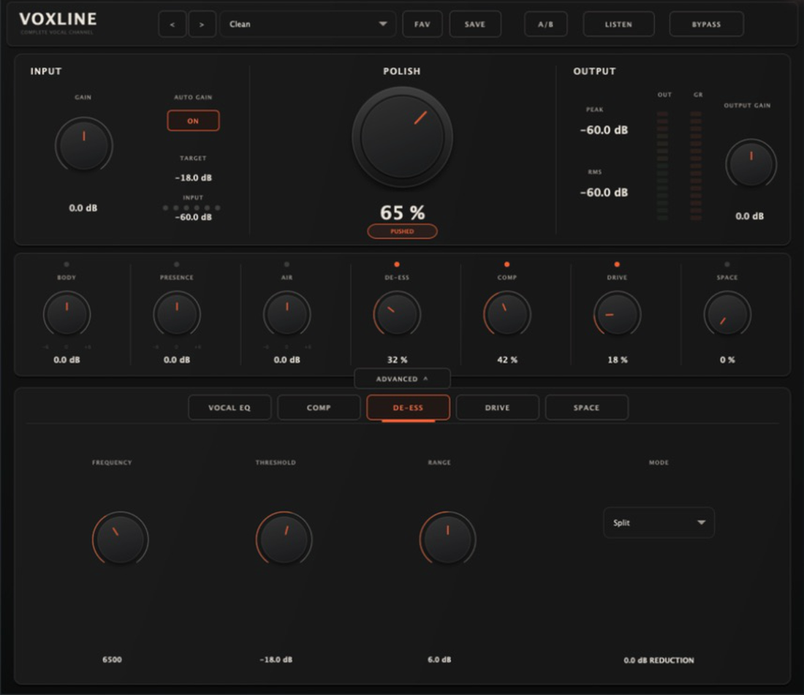
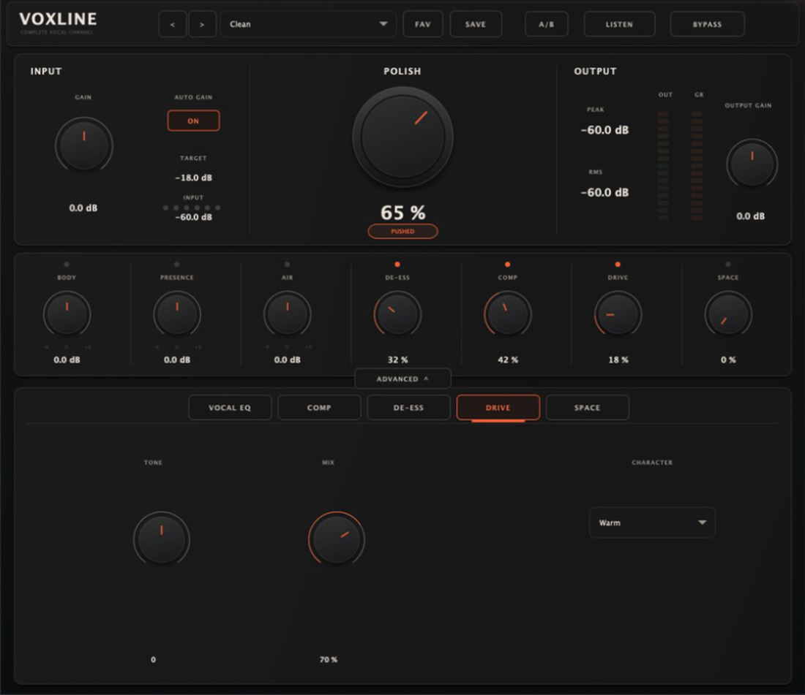
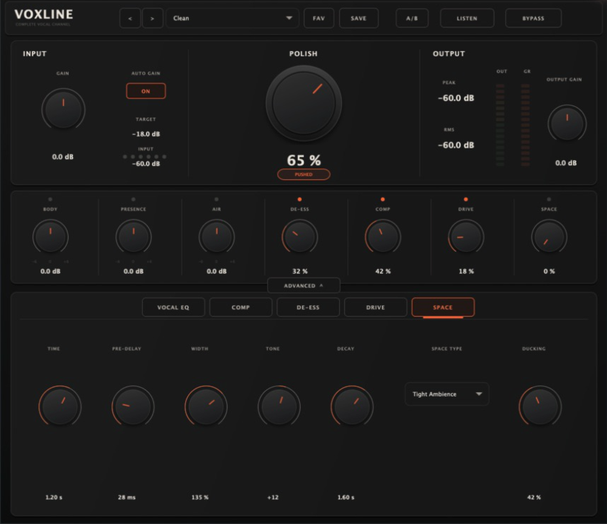

# VOXLINE 2.0 使用說明書

VOXLINE 是一套給人聲使用的完整效果鏈。你可以先用預設與 **POLISH** 快速得到可用的聲音，再視需要調整音色、齒音、動態、染色與空間感。所有處理都集中在同一個插件視窗，不必為了基本人聲處理來回切換多個效果器。

> 本說明適用於 VOXLINE `2.0.0`。開始混音前，建議先把人聲素材備份，並避免在高音量下突然大幅提升增益。

## 1. VOXLINE 是什麼

VOXLINE 依下列順序處理聲音：

`輸入增益 → Vocal EQ → De-Esser → Compressor → Drive → Space → 自動增益補償 → 輸出增益 → Soft Clip 保護`

主介面的旋鈕適合快速完成大部分調整；展開 **ADVANCED** 後，可以進一步控制 Vocal EQ、Compressor、De-Esser、Drive 與 Space。

主要特色：

- 深色單一介面與可收合的進階控制。
- 9 組原廠預設，以及使用者預設的儲存與載入。
- 六節點 Vocal EQ，支援圖形拖曳、精確數值輸入、Q／斜率調整。
- 輸入 Peak、RMS、輸出與 Gain Reduction 即時顯示。
- A/B 參數快照、LISTEN 差異監聽與平滑 BYPASS。
- 插件參數可由支援的宿主或 DAW 自動化。

## 2. 系統需求與安裝

### 下載正確版本

請從 GitHub 的 `v2.0.0` Release 下載符合電腦的檔案：

| 系統 | 檔案 | 內容 |
|---|---|---|
| macOS Apple Silicon | `VOXLINE-2.0.0-macOS-Apple-Silicon.dmg` | 適用 Apple M 系列晶片，含 VST3 與 AU |
| macOS Intel | `VOXLINE-2.0.0-macOS-Intel.dmg` | 適用 Intel 晶片 Mac，含 VST3 與 AU |
| macOS Universal | `VOXLINE-2.0.0-macOS-Universal.dmg` | 同時支援 Apple Silicon 與 Intel，含 VST3 與 AU |
| Windows x64 | `VOXLINE-2.0.0-Windows-x64-VST3.zip` | 適用 64 位元 Windows，含 VST3 |

如果不確定 Mac 的晶片類型，請開啟「蘋果選單 → 關於這台 Mac」查看「晶片」或「處理器」。單一電腦優先選對應晶片版本；需要在不同 Mac 間共用時可選 Universal。

### macOS

1. 關閉正在執行的 DAW 或插件宿主。
2. 打開下載的 `.dmg`。
3. 執行其中的 `.pkg` 安裝程式，依畫面完成安裝。
4. 重新開啟 DAW，執行插件重新掃描。

安裝程式會把插件放到系統插件目錄：

- VST3：`/Library/Audio/Plug-Ins/VST3/`
- AU：`/Library/Audio/Plug-Ins/Components/`

如果 macOS 阻擋第一次開啟，請確認檔案來自本專案的正式 GitHub Release，再前往「系統設定 → 隱私權與安全性」查看可用的允許開啟選項。不要對來源不明的插件略過系統安全警告。

### Windows x64

1. 關閉正在執行的 DAW 或插件宿主。
2. 解壓縮 `VOXLINE-2.0.0-Windows-x64-VST3.zip`。
3. 把解壓後的 `VOXLINE.vst3` 複製到：

   `C:\Program Files\Common Files\VST3\`

4. 重新開啟 DAW，執行 VST3 重新掃描。

若 Windows 要求系統管理員權限，請允許檔案複製到上述系統資料夾。VOXLINE 2.0 的 Windows 發佈版本為 VST3，不包含 AU。

### 在 DAW 中載入

建立或選取一條人聲音軌，把 VOXLINE 插入在人聲軌的效果器插槽。若你已在同一軌使用其他處理器，建議先暫時旁通它們，確認 VOXLINE 的增益與音色，再逐一恢復其他效果。

## 3. 60 秒快速開始

1. 播放整段人聲，把 **INPUT GAIN** 調到輸入表頭不長時間貼近頂端。一般可先讓最高峰落在約 `-18` 至 `-10 dBFS`。
2. 從 **Clean** 預設開始，或用上方左右按鈕切換原廠預設。
3. 緩慢提高 **POLISH**。先從 `40–65%` 試起，聽人聲是否更集中、清楚。
4. 小幅調整 **BODY／PRESENCE／AIR**。這三顆都是以 `0 dB` 為中心，可向正、負兩側調整。
5. 視素材增加 **DE-ESS、COMP、DRIVE**；每次只改一項，並用相近音量比較。
6. 需要環境或寬度時再加入少量 **SPACE**。
7. 用 **OUTPUT GAIN** 對齊處理前後的主觀音量，再切換 **BYPASS** 判斷是不是真的更好。

> 快速起點：POLISH `50%`、DE-ESS `15–30%`、COMP `25–45%`、DRIVE `0–15%`、SPACE `0–12%`。這些不是標準答案；齒音、錄音距離與曲風都會改變合適設定。

## 4. 主介面

### INPUT

- **INPUT GAIN**：進入整條效果鏈前的音量，範圍為 `-24 至 +24 dB`。輸入太大會讓 Compressor、Drive 與最後的保護處理過早工作。
- **AUTO GAIN**：依目前處理量提供補償，方便快速維持合理輸出。做最終音量匹配時，仍應以耳朵和輸出表頭為準。
- **INPUT PEAK／RMS**：Peak 顯示瞬間最高電平，RMS 反映較接近平均響度的變化。

### POLISH

**POLISH** 是整體強度巨集，會一起縮放音色、壓縮與染色的作用量；它不是單純的 Dry/Wet。數值愈高，整條效果鏈的個性通常愈明顯。

- 自然、保留動態：先試 `25–50%`。
- 現代、較貼前的人聲：先試 `50–75%`。
- 若齒音、底噪或房間聲也被凸顯，先降低 POLISH，再到對應進階頁處理。

### BODY、PRESENCE、AIR

三顆旋鈕皆為雙向音色控制，中央是 `0 dB`，範圍為 `-6 至 +6 dB`，並與 Vocal EQ 的 LOW、PRES、AIR 節點同步。

- **BODY**：調整人聲低中頻的厚度。太多會混濁；太少會顯得單薄。
- **PRESENCE**：調整字頭與靠前感。提升過多可能尖銳或鼻音明顯。
- **AIR**：調整高頻空氣感。提升前先處理明顯齒音與底噪。

建議一次以 `0.5–1.5 dB` 的幅度調整，避免只因處理後比較大聲而誤判。

### DE-ESS、COMP、DRIVE、SPACE

- **DE-ESS**：齒音抑制總量。先加到「s、sh、ch」不刺耳，再稍微退回。
- **COMP**：壓縮總量。提高會讓人聲音量更穩、位置更靠前。
- **DRIVE**：飽和與諧波總量，可增加密度與存在感。
- **SPACE**：空間效果總量；主旋鈕為主要濕聲控制，細節在 Space 進階頁。

### 上方功能

- **Preset**：選擇 9 組原廠預設，或載入 `.vxpreset` 使用者預設。可用左右按鈕快速切換，並用 SAVE 儲存目前狀態。
- **A/B**：在 A、B 兩份完整參數快照間切換，適合比較不同設定。
- **LISTEN**：輸出「處理後與原聲的差異訊號」，用來聽目前被改變或移除的內容。它不是一般 Solo，完成檢查後請關閉。
- **BYPASS**：平滑切換原聲與完整處理後訊號。

## 5. Vocal EQ

展開 **ADVANCED**，選擇 **VOCAL EQ**。全寬頻譜區會顯示即時分析與 EQ 響應曲線，六個編號節點依序為：

| 節點 | 頻段 | 用途 | 可調參數 |
|---|---|---|---|
| 1 | HPF | 移除低頻震動、腳步或不需要的超低頻 | Frequency、Slope |
| 2 | LOW | 人聲厚度與低中頻重量 | Frequency、Gain、Q |
| 3 | MUD | 找出並削減混濁或箱體感 | Frequency、Gain、Q |
| 4 | PRES | 子音清晰度與靠前感 | Frequency、Gain、Q |
| 5 | AIR | 高頻光澤與空氣感 | Frequency、Gain、Q |
| 6 | LPF | 收掉過亮的頂端、嘶聲或高頻噪音 | Frequency、Slope |

### 圖形操作

- 點選節點或下方的 **HPF／LOW／MUD／PRES／AIR／LPF** 按鈕來選擇頻段。
- 左右拖曳節點可改變頻率；LOW、MUD、PRES、AIR 也可上下拖曳改變增益。
- 在節點上使用滑鼠滾輪，可調整 Q；HPF／LPF 則調整斜率。
- 雙擊節點可把該頻段恢復預設值。
- 下方 **FREQ／GAIN 或 SLOPE／Q** 可精確調整；點擊數值欄可直接輸入目標值。
- **±12 dB／±24 dB** 只切換圖表的垂直顯示範圍，不會額外改變聲音或增加延遲。
- **RESET** 重設目前選取的頻段；**EQ ON** 可單獨旁通 Vocal EQ。

### 建議起點

- HPF：男聲可先試 `60–90 Hz`，女聲可先試 `80–120 Hz`，再依音域與錄音判斷。斜率先從 `12 或 24 dB/oct` 開始。
- LOW：若人聲太薄，可在 `100–200 Hz` 附近增加約 `0.5–1.5 dB`。
- MUD：在 `250–500 Hz` 附近尋找混濁，先試削減 `1–3 dB`，不要一開始就使用很窄的 Q。
- PRES：在 `1.5–4 kHz` 附近小幅提升清晰度；如果人聲已刺耳，應減少而不是提升。
- AIR：在 `8–14 kHz` 附近增加 `0.5–2 dB`，同時留意齒音與底噪。
- LPF：通常可先放在 `16–20 kHz`；只有頂端真的太亮或有噪音時才往下移。

> EQ 的目標是修正與塑形，不是讓曲線看起來「有做事」。若需要超過約 `3–4 dB` 的大幅修正，請先檢查錄音、麥克風距離與其他處理是否才是真正原因。

## 6. Compressor

主介面的 **COMP** 控制整體壓縮強度；進階頁提供：

| 參數 | 作用 | 安全起點 |
|---|---|---|
| Threshold | 設定開始壓縮的電平 | 先試 `-24 至 -12 dB` |
| Ratio | 超過門檻後的壓縮比例 | 先試 `2:1 至 4:1` |
| Attack | 壓縮器反應速度 | 先試 `10–30 ms` |
| Release | 壓縮器回復速度 | 先試 `60–150 ms` |
| Mix | 壓縮後訊號的混合量 | 自然感可試 `60–85%`；完整效果可用 `100%` |

觀察輸出區的 **GR** 表頭：一般主唱可先讓明顯句子產生約 `2–6 dB` 的 Gain Reduction。Attack 太快可能吃掉字頭，太慢則抓不住尖峰；Release 太快可能喘動，太慢會讓下一句一直被壓住。

調整時先固定 COMP，再用 Threshold 決定壓縮頻率、Ratio 決定力度，最後配合 Attack／Release 與 Mix。壓縮會放大底噪、呼吸聲與房間聲；如果人聲失去起伏或一直黏在最前面，請降低 COMP、Ratio 或提高 Threshold。

## 7. De-Esser

主介面的 **DE-ESS** 控制整體齒音抑制量；進階頁提供：

| 參數 | 作用 | 安全起點 |
|---|---|---|
| Frequency | 鎖定容易刺耳的高頻區域 | 先試 `5–8 kHz` |
| Threshold | 決定多大的齒音會觸發處理 | 由 `-18 dB` 附近開始，邊聽邊調 |
| Range | 限制最大衰減量 | 先試 `3–6 dB` |
| Mode | `Split` 只處理偵測頻帶；`Wide` 觸發時壓低較完整的訊號 | 先用 Split |

用人聲中齒音最明顯的一句循環播放，先找 Frequency，再降低 Threshold，直到齒音受控。若人聲變得含糊、像漏風或「s」音消失，代表處理過多；請降低 DE-ESS、減少 Range，或改回 Split。

進階頁會顯示實際 De-Esser reduction，可用來確認是否只有齒音出現時才明顯工作。

## 8. Drive

**DRIVE** 會增加飽和、諧波與密度。進階頁提供：

- **Tone**：往負值讓染色較暗，往正值讓染色較亮。
- **Mix**：控制 Drive 效果的混合比例。
- **Character**：
  - `Clean`：較克制、適合只增加少量密度。
  - `Warm`：較溫暖，是多數人聲的穩妥起點。
  - `Edge`：較強烈、較突出，適合需要存在感的段落。

建議先把 DRIVE 設在 `5–15%`，Character 選 Warm，Mix 設在 `50–70%`，再依需要調 Tone。Drive 很容易讓處理後聽起來比較大聲；請用 OUTPUT GAIN 對齊音量後再比較。若「s」音變尖、低頻變糊或波形失去動態，應減少 DRIVE 或 Mix。

## 9. Space

**SPACE** 用來加入環境感、短延遲或立體寬度。進階頁提供三種 Type：

- **Tight Ambience**：短而貼近，適合讓乾人聲融入混音。
- **Filtered Slap**：較明顯的短延遲感，適合增加厚度與節奏。
- **Stereo Wide**：利用左右差異建立較寬的空間。

可調參數：

| 參數 | 作用 | 安全起點 |
|---|---|---|
| Time | 空間或延遲的主要時間尺度 | Tight 可從短時間開始；Slap 可先試約 `80–160 ms` |
| Pre-delay | 乾聲到空間聲出現前的間隔 | 先試 `15–40 ms` |
| Width | 立體寬度 | 先試 `100–135%` |
| Tone | 空間聲的明暗 | 太搶字頭時往暗調 |
| Decay | 尾音持續時間 | 先試 `0.8–1.8 s` |
| Ducking | 唱歌時壓低空間聲、句尾再浮現 | 先試 `25–55%` |

先選 Type，再把主介面的 SPACE 從 `0%` 慢慢提高。主唱通常以「感覺得到但不明顯聽見」為起點。若字句後退、咬字不清，請減少 SPACE 或 Decay、增加 Pre-delay／Ducking；若立體聲在單聲道下變薄，請降低 Width。

## 10. 建議人聲工作流程

### 自然清晰主唱

1. 用 INPUT GAIN 建立合理輸入。
2. 選 Clean，POLISH 設在 `40–60%`。
3. Vocal EQ 只做必要的 HPF 與少量 MUD 修正。
4. DE-ESS 只在齒音出現時工作。
5. COMP 取得約 `2–4 dB` GR。
6. DRIVE 使用 Clean 或 Warm，低混合量。
7. 以 Tight Ambience 加入少量 SPACE。
8. 對齊 OUTPUT GAIN，用 BYPASS 比較。

### 貼前、現代的人聲

1. POLISH 可從 `55–75%` 開始。
2. 小幅提升 PRESENCE 或 AIR，但先確保齒音受控。
3. COMP 可提高到約 `4–6 dB` GR，再以 Mix 保留部分自然動態。
4. DRIVE 選 Warm，必要時用 Edge，但保持音量匹配。
5. Space 使用較高 Ducking，讓句子清楚、句尾仍有空間。

### 每次比較都要做的事

- 讓處理前後音量接近，再判斷音色。
- 用 A/B 保存兩個候選設定，不要只依記憶比較。
- 在整首混音中確認，而不是只 Solo 人聲。
- 低音量與耳機、喇叭都聽一次；重要成品再檢查單聲道。

## 11. 常見問題

### DAW 找不到 VOXLINE

1. 確認下載版本符合作業系統與晶片。
2. 確認插件位於正確位置：
   - macOS VST3：`/Library/Audio/Plug-Ins/VST3/`
   - macOS AU：`/Library/Audio/Plug-Ins/Components/`
   - Windows VST3：`C:\Program Files\Common Files\VST3\`
3. 關閉並重開 DAW，執行完整重新掃描或清除失敗掃描清單。
4. macOS 使用 Logic Pro 時請找 AU；其他宿主依支援格式選 VST3 或 AU。
5. 若仍找不到，確認沒有把整個 ZIP 或 DMG 留在下載資料夾而未實際安裝。

### 插件有畫面但沒有聲音

- 關閉 LISTEN，確認它沒有停留在差異監聽模式。
- 檢查 BYPASS、音軌路由、輸入／輸出與宿主的插件啟用狀態。
- 把 INPUT GAIN、OUTPUT GAIN 暫時恢復 `0 dB`，換回 Clean 預設測試。
- 暫時把其他效果器旁通，排除效果鏈其他位置造成的靜音。

### 處理後太大聲或太小聲

先切換 BYPASS 比較，再用 OUTPUT GAIN 對齊。AUTO GAIN 是快速補償工具，不代表每種素材都會得到完全相同的主觀音量。Drive、Compressor 與 EQ 提升都可能改變響度。

### EQ 節點不好精確調整

選取頻段後，使用下方 FREQ／GAIN 或 SLOPE／Q 控制；點擊數值欄可以鍵盤輸入，節點上的滑鼠滾輪可改 Q 或斜率。若曲線看起來太扁，可切換 `±12 dB` 顯示範圍；這只影響畫面比例。

### EQ 斜率數值變了，但曲線差異不明顯

確認選到 HPF 或 LPF，並把截止頻率移到目前畫面與素材中較容易觀察的位置。HPF 支援 `12／24／36／48 dB/oct`，LPF 支援 `12／24 dB/oct`。實際判斷仍應以聲音為主。

### 聲音變尖、變薄或失去自然感

先降低 POLISH，接著逐一檢查 AIR／PRESENCE、DE-ESS、COMP 與 DRIVE。不要同時大幅調低多個模組；用 A/B 或 BYPASS 找出真正造成問題的處理。

### 預設或設定沒有保留

DAW 專案會保存插件狀態。要跨專案使用同一組設定，請用 SAVE 儲存 `.vxpreset`，之後從 Preset 選單的 **Load User Preset…** 載入。移動或刪除該檔案後，原路徑將無法再次載入。

### 切換插件後 CPU 或畫面暫時卡頓

先停止播放再關閉、重開插件視窗。若問題持續，嘗試提高 DAW 的 Audio Buffer，確認使用正式 Release 檔案，並避免同時開啟過多即時頻譜畫面。

## 12. 版本與支援

- 產品版本：VOXLINE `2.0.0`
- macOS 格式：VST3、AU
- Windows 格式：VST3 x64
- 專案與發佈頁：[VOXLINE on GitHub](https://github.com/sd12504/Voxline)
- 問題回報：[GitHub Issues](https://github.com/sd12504/Voxline/issues)

回報問題時，請附上作業系統版本、Mac 晶片類型或 Windows 架構、DAW 名稱與版本、使用的插件格式、可重現步驟，以及不含私人資訊的畫面。若問題與聲音有關，請說明取樣率、Buffer Size 與發生問題的模組。
